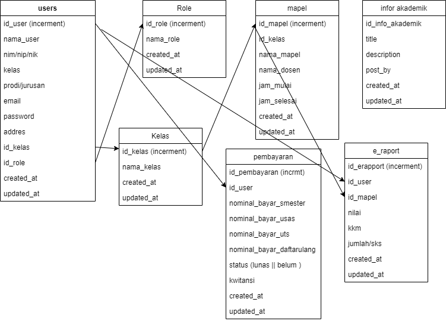

# Rest Api Kampusku

Rest Api kampusku adalah sebuah project percobaan latihan.. dimana nantinyah rest api ini akan di consume oleh mobile app dan web app

## Instalasi

### requirment

- [Git](https://git-scm.com)
- [Node Js](https://nodejs.org/en)
- [Text-editor](https://code.visualstudio.com/)


### Menggunakan npm

```
git clone https://github.com/Anggasayogo/Kampusku-Api.git
```

```
npm install
```

```
npm run dev
```

## TODO
- [ ] Menggunakan Database
- [ ] Refactotoring Code
- [ ] Lengkapi Readme.md file
- [ ] dll


## Design Table

